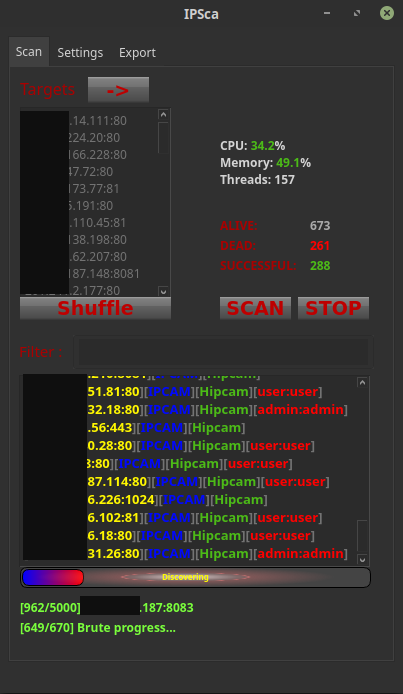

# IPSca-Reinforced. Forked from cam-stalk, by vladiroPatron
- Modified version of IPSca in order to avoid compatibilty and conectivity issues.

# Note
- Much love to cam-stalk, the original developer of this tool.
- Various changes made with <3 by vladiroPatron.

# Regarding IPSca

- Universal scanner for web interfaces of IoT devices
- Brute force function is embedded
- Graphic interface

# Usage

- python3 main.py

## Requirements
- Python >= 3.6 - install
- Python modules: `pip3 install -r requirements.txt`
- Installed masscan and added to $PATH variable

## Features
- Masscan is embedded (root required)
- Export to: json, csv, html (ipcam screenshots)
- Capturing shapshots from: iCatch, Hipcam, Hikvision (App-Webs/), GoAhead, Foscam, Netwave, Tenvis, D-Link

## Crashing Fixes
- If your client crashes while exporting the ips, in the main folder make a folder called results and in that folder make another one called Export. This should fix it.
- If your client crashes randomly while brutef. or scanning ips, run the file with sudo (Eg: sudo python3 main.py) and make sure that all ips have ports after them and that there are no blank rows.

## Disclaimer
- For educational use only
